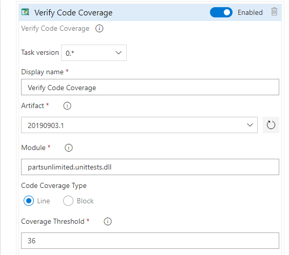
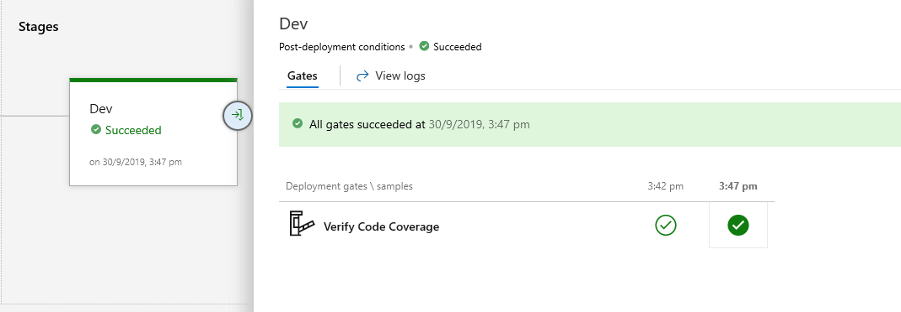
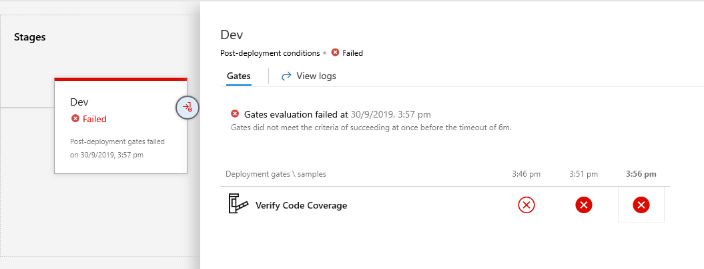

# Authoring custom gates

Release gates allow controlled automatic collection of health signals from external services,
  and promote the release when all signals indicate a healthy deployment. 
In this example, we'll add a release gate to validate code coverage on a module before deployment.

## Add gate to the release pipeline

1. Once the extension is installed on your account, you can add the new gate to your release pipelines.

1. Enable **Gates** and add **Code Coverage** to the gate.

    

1. The release would wait for the cumulative code coverage for the chosen module 
to reach the threshold before proceeding to the next stage. Configure the gate as shown below.

    

## Task Inputs

|**Parameters**  |**Description**  |
|---------|---------|
|**Artifact**     | Select the build artifact |
|**Module**     | **(Case sensitive)** Name of the module or dll to evaluate |
|**Code Coverage Type**| **Line** : to evaluate the number of lines not covered |
|     | **Block**  : to evaluate the number of blocks not covered |
|**Coverage Threshold**  | Set the maximum threshold for line or blocks to pass the gate        |

## Gates in action

When the number of lines not covered is less than the threshold, the gate is passed.
 
 **Example** :  Lines not covered - 37
                Threshold - 38 - Pass

When the number of lines not covered is greater than the threshold, the gate is failed.

**Example**: Lines not covered - 37 - Threshold - 36 - Pass

