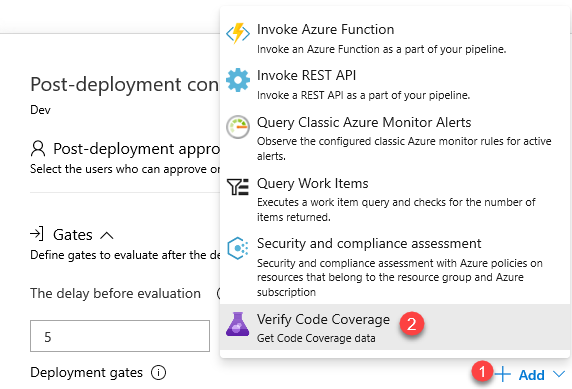

# Verify Code Coverage Extension

This extension includes a release gate to validate code coverage on a module before deployment. The gate is useful to ensure that there is Quality validation on the build artifacts such as pass rate or code coverage and deploy only if they are within the required thresholds.

## Prerequisites

Follow the document [here]()

## Gate

Installing the extension adds the following **Verify Code Coverage** gate and agentless task.

## Gate snapshot

## Input parameters

The gate requires the following inputs:

- **Module**: Name of the module or dll from the primary artifact to verify code coverage for

- **Code Coverage Type** : Line or Block

- **Coverage Threshold**: Set the maximum desired threshold for line or blocks not covered. If the lines / blocks not covered is more than the threshold, the task will fail.

## Contact Information:

You can use [Azure Pipeline Extensions on Github](https://github.com/Microsoft/azure-pipelines-extensions/issues) to report any issues.